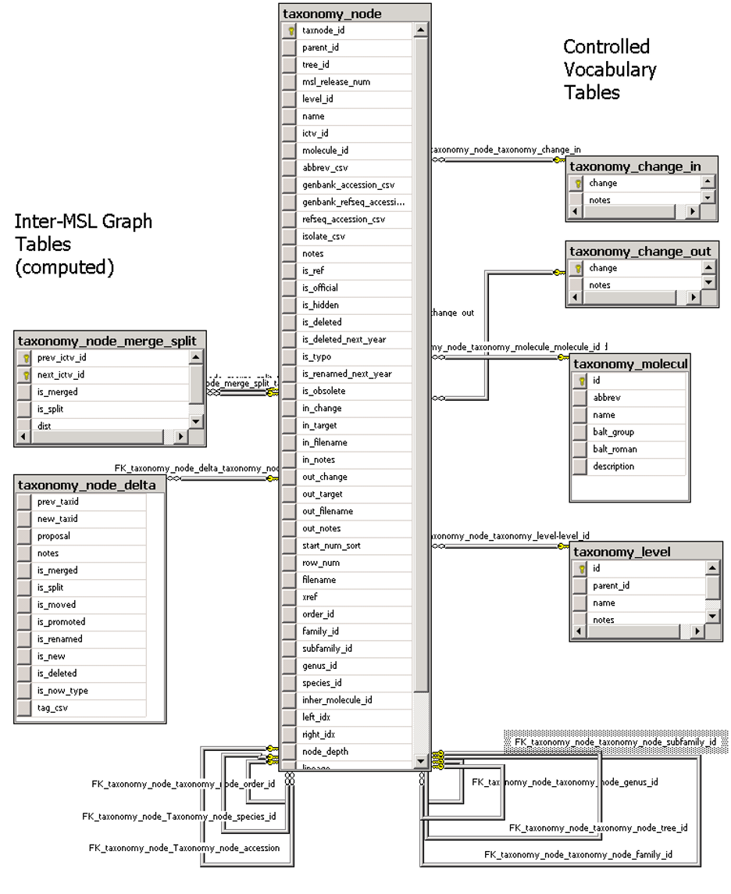
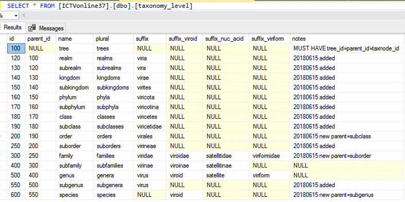
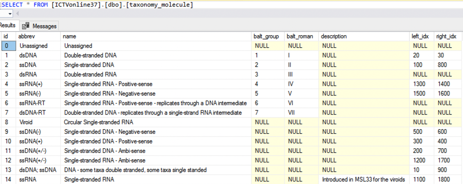
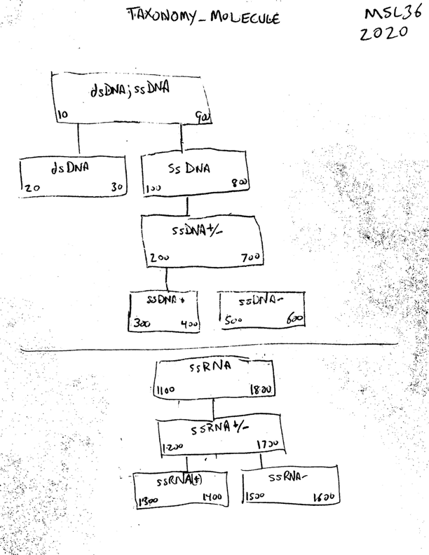

[TOC]

# ICTV.global SCHEMA

## Overview

These tables support the taxonomy database found at 
  * https://ictv.global/taxonomy/history
  * https://ictv.global/taxonomy
  * https://ictv.global/taxonomy/visual-browser
  * https://ictv.global/taxonomy/etymology

### Core datasets
  1. taxonomy_node (SQL table) - stores multiple taxonomy trees, linked across years, trees stored using "[nested set model](https://en.wikipedia.org/wiki/Nested_set_model)"
  1. species_isolates (SQL table) - important isolates in each species, not linked to a specific taxonomy release
  1. virus_properties (Drupal WebForm) - additional info about physical attributes of species, not linked to a specific year (TBA)
  1. demarcation_criteria  (Drupal WebForm) - additional info about how taxa are defined and delimited, not linked to a specific year (TBA)
  1. taxon_etymology (Drupal WebForm) - additional info about how taxa are defined and delimited, not linked to a specific year (TBA)

## Taxonomy Trees: Primary Data & supporting controlled vocabularies



 1. [taxonomy_node](dbo.taxonomy_node.Table.sql) 
  * This table contains all the taxonomy hierarchies for all the years, and the information needed to link between years. 

| Column | Type | Key | Description |
| -----  | ---- | --- | ----------- |
| **>>>>>>>** | **>>>** | **>>>>>** | **primary taxonomy tree columns**  |
| taxnode_id | int | PK | uniquely identifies a taxon in a year |
| parent_id  | int | FK taxonomy_node.taxnode_id | defines the intra-year taxonomy heirarchy, must point to a taxon of a higher rank, the root node, "year", points to itself |
| tree_id    | int | FK taxonomy_toc.tree_id | defines the year (should match 1-1 with msl_release_num) |
| msl_release_num | int | FK taxonomy_toc.tree_id | defines the MSL (Master Species List), if this is an ICTV taxonomy (should match 1-1 with tree_id) |
| level_id   | int | FK taxonomy_level.id | defines rank taxa (Order, Family, Genus, ...) |
| name       | varchar | | Name of the taxon |
| **>>>>>>>** | **>>>** | **>>>>>** | **links to previous and next year**<BR>these are used to generate [taxonomy_node_delta] and [taxonomy_node_merge_split] tables  |
| ictv_id | int | FK taxonomy_node.taxnode_id | id of the first time a taxon created, links taxa across (rename,move,promote,demote), but not (split,merge) |
| in_change | varchar | | change relative to previous year: new or split |
| in_target | varchar | | (not used) |
| in_filename | varchar | | CSV of filename(s) of proposal(s) justifying the change(s) |
| in_notes | varchar | | |
| out_change | varchar | | change relative to next year: rename, move, promote, demote, merge |
| out_target | varchar | | name or lineage (semicolon separated names) of taxon in the next year |
| out_filename | varchar | | CSV of filename(s) of proposal(s) justifying the change(s) |
| out_notes | varchar | | |
| **>>>>>>>** | **>>>** | **>>>>>** | **taxon attributess**  |
| molecule_id | int | FK taxonomy_molecule.id| type of genome |
| start_sort_num | int  | | offset within name to find a number to be parsed and used to override alphabetical sorting of name - mostly applies when there are more than 9 of something, and an alphabetical sort would place 10 before 2. |
| abbrev_csv | nvarchar | | abbreviations for the virus |
| genbank_accession_csv | nvarchar | | Genbank accession number(s),comma or semicolon separated, optionally with "segment_name:" prefix  |
| genbank_refseq_accession_csv | nvarchar | | (not used)|
| refseq_accession_csv | nvarchar | | RefSeq accesion number (not used after MSL29)|
| isolate_csv | nvarchar | | comma or semicolon separated list of isolate names|
| notes | nvarchar | | notes to the db curator |
| is_ref | int | (0,1) | aplies only to species; flags the reference species in a genus; not used after MSL 35 |
| is_official | int | (0,1) | not used after MSL22 |
| is_hidden | int | (0,1) | do not display the taxon. Mostly used to mark the root node of each year's taxonomy, but sometimes used to hide erroneous records.|
| is_deleted | int | (0,1) | used in conjunction with ```is_hidden``` |
| is_deleted_next_year | int | (0,1) | obsolete |
| is_typo | int | (0,1) | used in conjunction with ```is_hidden``` |
| is_renamed_next_year | int | (0,1) | obsolete |
| is_obsolete | int |  (0,1) | obsolete (no longer used) |
| filename | varchar | | document this record was loaded from, usually proposal .xlsx file, or merge thereof |
| row_num | int | | row number in ```filename``` original document |
| xref | varchar | | used in ICTVdb taxonomy (tree_id=10090000) to store accession string for ICTVdb database (obsolete) |
| **>>>>>>>** | **>>>** | **>>>>>** | **following columns are cached values set by a trigger**<BR>[TR_taxonomy_node_UPDATE_indexes](dbo.TR_taxonomy_node_UPDATE_indexes.Trigger.sql),<BR> which in turn calls the stored procedure [taxonomy_node_compute_indexes](dbo.taxonomy_node_compute_indexes.StoredProcedure.sql) to do the actual update**. |
| left_idx,right_idx,node_depth | int | | "[nested set model](https://en.wikipedia.org/wiki/Nested_set_model)" indicies: ordering in a depth-first traversal of the MSL taxonomy for each year. Used for parent-of/child-of queries |
| lineage | varchar | | ";"-separated list of names based on parent_id | 
| inher_molecule_id | int | FK taxonomy_molecule.id | molecule ID of closest ancestor with a molecule_id setting |
| {rank}_id | int | FK taxonomy_node.taxnode_id | based on parent_id & level_id, ids of higher-ranked taxa in which this taxon is contained
| {rank}_kid_ct | int | number of taxa of {rank} that are direct children of this taxon |
| {rank}_desc_ct | int | number of all taxa of {rank} that are in this taxon (desc=descendent) |
| taxa_kid_cts | varchar | | English summary of {rank}_kid_ct (eg, "2 kingdoms, 2 families, 4 genera") ||
| taxa_desc_cts | varchar | | English summary of {rank}_desc_ct (eg, "2 kingdoms, 6 phyla, 2 subphyla, 21 classes, 30 orders, 8 suborders, 117 families, 53 subfamilies, 1019 genera, 84 subgenera, 4317 species") ||
| **>>>>>>>** | **>>>** | **>>>>>** | **computed columns** |  
| cleaned_name | varchar | | ```name``` with any diacritical marks removed | 
| cleaned_problems | varchar | | what diacritical marks were removed from ```name```  | 
| flags | varcahr | | semi-colon separated list of is_XXX flags that are set |
| _numKids | int | | number of sub-taxa (recursive) | 
| _out_target_parent | varchar | | if ```out_target``` is a ;-separated lineage, all but the last name in the lineage |
| _out_target_name | varchar | | if ```out_target``` is a ;-separated lineage, only last name in the lineage |

 1. Supporting TABLES that define years and controled vocabularies:
  * [taxonomy_toc](dbo.taxonomy_toc.Table.sql) - Table of Contents 
    * defines MSL release numbers and tree IDs. Must have a row for each taxonomy stored in ```taxonomy_node```. 
    * data glympse 
  * [taxonomy_change_in](dbo.taxonomy_change_in.Table.sql) - defines values for ```taxonomy_node.in_change```
    * data glympse 
  * [taxonomy_change_out](dbo.taxonomy_change_out.Table.sql) - defines values for ```taxonomy_node.out_change```
    * data glympse 
  * [taxonomy_level](dbo.taxonomy_level.Table.sql) - defines ranks
    * defines values for ```taxonomy_node.level_id```
    *  maps level_id to rank name (Order, Family, Genus,...)
    * defines allowable suffixes per
    * data glympse 
  * [taxonomy_molecule](dbo.taxonomy_molecule.Table.sql) 
    * defines values for ```taxonomy_node.molecule_id```. 
    * data glympse 
    * Also defines a hierarchy for molecule types using : 
  * [taxonomy_host_source](dbo.taxonomy_host_source.Table.sql) 
    * defines values for ```taxonomy_node.host_source```. 
  * [taxonomy_genome_coverage](dbo.taxonomy_genome_coverage.Table.sql) 
    * defines values for ```taxonomy_node.genome_coverage```. 


##  Cache Tables

these store data pre-computed from taxonomy_node, which makes the queries that serve the website possible in real time. 
  * [taxonomy_node_delta](dbo.taxonomy_node_delta.Table.sql) 
    * link the taxa of one year in ```taxonomy_node```, to the taxa of the next year, annotate what changed and why
    * computed by [dbo.rebuild_delta_nodes.StoredProcedure.sql](dbo.rebuild_delta_nodes.StoredProcedure.sql) for recent MSLs, hand-built for some of the older ones
    * 
  * [taxonomy_node_merge_split](dbo.taxonomy_node_merge_split.Table.sql)
    * link each taxa in ```taxonomy_node``` to all previous and future versions of that taxon. 
    * This is essentially a transitive closure of the ```taxonomy_node_delta```.
    * computed by Stored Procedure [dbo.rebuild_node_merge_split.StoredProcedure.sql](dbo.rebuild_node_merge_split.StoredProcedure.sql)

## Supporting VIEWS that simplify access

  * [MSL_export_fast](dbo.MSL_export_fast.View.sql) - quickly export the MSL for a year. For full MSL metadata, use the StoredProcedure [MSL_export_official](dbo.MSL_export_official.StoredProcedure.sql)
  * [taxonomy_node_dx](dbo.taxonomy_node_dx.View.sql) - join of taxonomy_node through taxonomy_node_delta (twice) with previous and next year's taxonomies.
  * [taxonomy_node_names](dbo.taxonomy_node_names.View.sql) - join of taxonomy_node with controlled vocabulary tables, so in addition to "genus_id" actually has "genus" with the actual name of the genus.
  * [taxonomy_node_x](dbo.taxonomy_node_x.View.sql) - join of taxonom_node thorugh ```taxonomy_node_merge_split```, to list all previous and future versions of this taxon
  * [taxonomy_toc_dx](dbo.taxonomy_toc_dx.View.sql) - join of taxonomy_toc with itself to link current year to previous year, used for lookup of previous year's tree_id
  * [view_taxa_level_counts_by_release](dbo.view_taxa_level_counts_by_release.View.sql) - per-MSL (year) counts of all ranks: realms through species. 
  * [view_taxonomy_stats](dbo.view_taxonomy_stats.View.sql) - (no longer used after MSL32, when realm and sub{ranks} were added) per-MSL counts for orders, familes, subfamilies, genera, species

## Associated Data about Taxa


  * These are additional data linked to the species (or other rank taxa) described in taxonomy_node, but not linked to the specific year.
  * There are fields in the main ```taxonomy_node``` table for many of these attributes. 
     * When new taxa are loaded from ICTV proposals, the information is loaded into ```taxonomy_node```, and from there get copied into these tables.
  * The updated version of thse fields are then maintained in these associated data tables, without going back to update the version in ```taxonomy_node```. 

## Associatd Data Sets

### species_isolates

Format: MSSQL Table
   * Schema: create [species_isolates](dbo.species_isolates.Table.sql) table SQL 
   * data: data/[species_isolates.utf8.txt](../data/species_isolates.utf8.txt)

Web Pages: generates the "member species" table on the web page for each chapter of the ICTV Report.  
   * Page: [Hepadnaviridae](https://ictv.global/report/chapter/hepadnaviridae/taxonomy/hepadnaviridae)  
   * Page: [Avihepadnavirus](https://ictv.global/report/chapter/hepadnaviridae/hepadnaviridae/avihepadnavirus)  

Contents:
   * each isolate has a unique "isolate_id" that links all the segments of that isolate.
   * links back to taxonomy_node table via taxnode_id (many-to-one: isolate_id:taxnode_id = N:1)
   * includes GenBank (and RefSeq, if available) accession numebers
   * accession numbers will be provided by segment, if applicable, including segment names, when available.
       * these lists are "packed" into a single database column
           * example: ```DNA-A: MK430076; DNA-B: MK430077; DNA-C: MK430078```
       * Segment accession numbers are separated by a semi-colon (;)
       * Optional segment names prefix the accession number, and are separated from it by a colon (:)
       * all spaces are ignored. 
   * lists exemplar & additional virus isolates
   * updated by study groups, posted immediately
       * releases numbered by when an updated xlsx file is posted (frequently)
   * TBA: NCBI taxids and other metadata

### Dataset: virus_properties 

Format: 
   * Drupal WebForm; in development

Web Pages: 
   * TBD

Contents:
   * Additional metadata on physical attributes of viruses.

### Dataset: demarcation_criteria

Format: 
   * Drupal WebForm; in development

Web Pages: 
   * TBD

Contents:
   * Additional metadata on how taxa are delineated.

### Dataset: taxon_etymology


Format: 
   * Drupal WebForm; in development

Web Pages: 
   * Page: https://ictv.global/taxonomy/etymology

Contents:
    * Additional metadata on the derrivation of the taxon names.

## ICTVdb Linkage (obsolete)

### Tables
  * [ictvdb_index](dbo.ictvdb_index.Table.sql)
  * [ictvdb_sun_ah](dbo.ictvdb_sun_ah.Table.sql)
### Views
  * [ictvdb_family](dbo.ictvdb_family.View.sql)
  * [ictvdb_genus](dbo.ictvdb_genus.View.sql)
  * [ictvdb_order](dbo.ictvdb_order.View.sql)
  * [ictvdb_species](dbo.ictvdb_species.View.sql)
  * [ictvdb_subfamily](dbo.ictvdb_subfamily.View.sql)


π